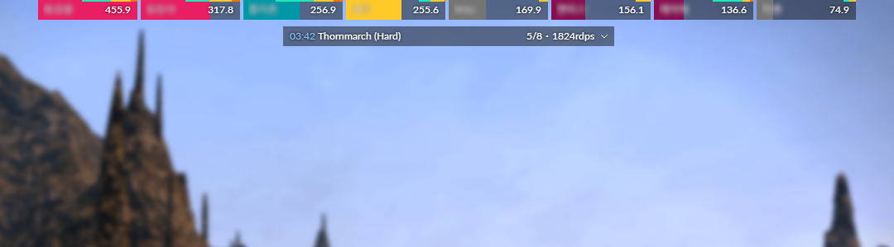
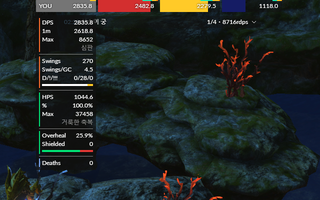

# ikegami

## Example

 In 8-player duty:

 Detailed view (when hover, username manually redacted):

## Installation

 Select `Ikegami` preset from your ACT Plugin, or to add manually, use the URL
`https://idyllshi.re/ikegami`.

### About HTTP
 this domain serves on HTTP, because browsers doesn't allow downgrade to
`ws://` connection. ACTWebSocket provides `ws://` interface, but doesn't
includes local certificate which required to `wss://`.

##
